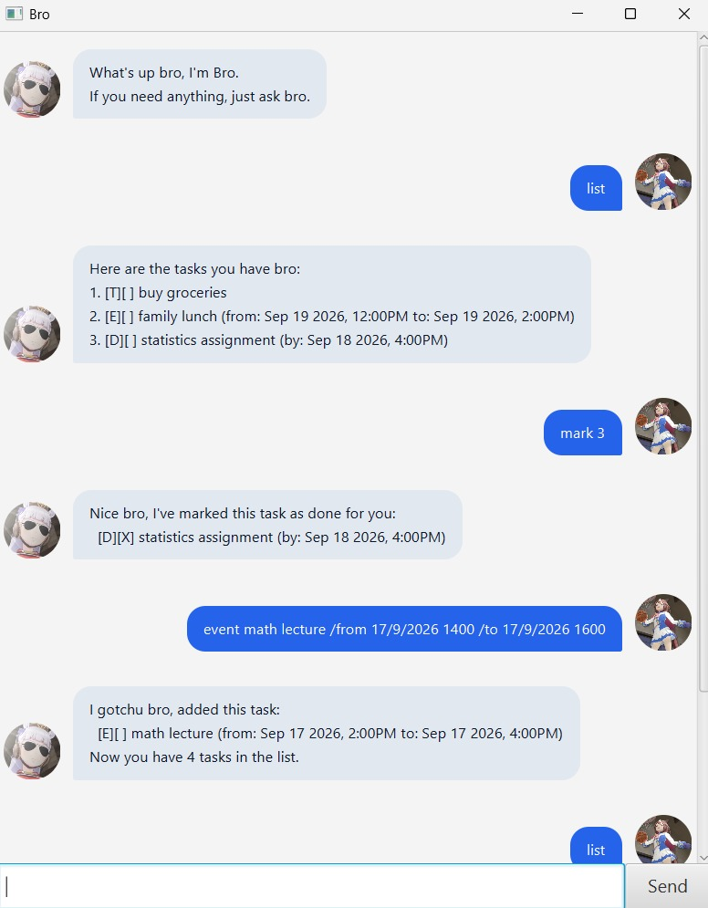
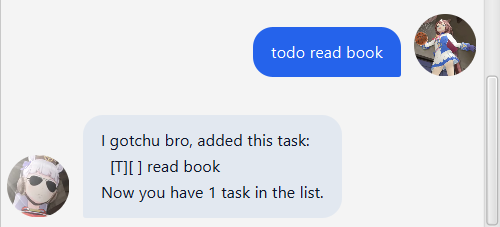
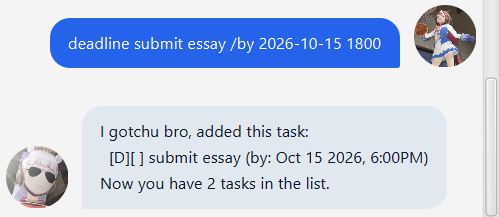
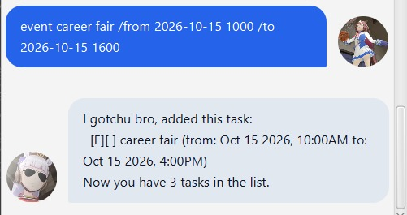
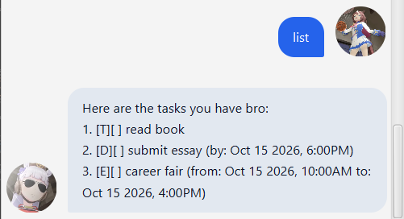
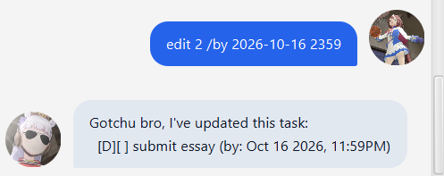

# Bro - User Guide



**Bro** is a desktop interactive to-do list application tailored for users who prefer working with a **Command Line Interface (CLI)** while enjoying the clean responsiveness of a **Graphical User Interface (GUI)**.

True to his name, Bro interacts with you just like a laid-back close friend: always got your back, keeping your tasks organized without any stress or fuss.

---

## Table of Contents

- [Quick Start](#quick-start)
- [Command Format Notes](#command-format-notes)
- [Features](#features)
  - [Adding a to-do: `todo`](#adding-a-to-do-todo)
  - [Adding a deadline: `deadline`](#adding-a-deadline-deadline)
  - [Adding an event: `event`](#adding-an-event-event)
  - [Listing all tasks: `list`](#listing-all-tasks-list)
  - [Marking a task as done: `mark`](#marking-a-task-as-done-mark)
  - [Unmarking a task: `unmark`](#unmarking-a-task-unmark)
  - [Editing a task: `edit`](#editing-a-task-edit)
  - [Finding tasks by keyword: `find`](#finding-tasks-by-keyword-find)
  - [Viewing tasks on a date: `tasks`](#viewing-tasks-on-a-date-tasks)
  - [Deleting a task: `delete`](#deleting-a-task-delete)
  - [Exiting the app: `bye`](#exiting-the-app-bye)
- [Date & Time Formats](#date--time-formats)
- [Data Storage](#data-storage)
  - [Saving the data](#saving-the-data)
  - [Editing the data file](#editing-the-data-file)
- [FAQ](#faq)
- [Command Summary](#command-summary)

---

## Quick Start

1. Ensure that you have **Java 25** (or Java 17+) installed on your computer.
2. Download the latest `bro.jar` from the project's [GitHub Releases](https://github.com/denzelgoo/ip/releases).
3. Copy the file into the folder you want to use as the home directory for Bro.
4. Open a command terminal, navigate (`cd`) into that folder, and run:

   ```bash
   java -jar bro.jar
   ```

5. A GUI window will appear in a few seconds showing Bro's initial greeting.
   
6. Type a command in the input box at the bottom and press **Enter** (or click **Send**) to execute it. Here are some quick examples to try:
   - `todo read book` : Adds a to-do task to your list.
   - `list` : Lists all your current tasks.
   - `mark 1` : Marks the 1st task as done.
   - `bye` : Closes the application.
7. Refer to the [Features](#features) section below for detailed usage of every command.

---

## Command Format Notes

- **Parameters**: Words in `<UPPER_CASE>` are parameters to be supplied by you.  
  *Example:* in `todo <DESCRIPTION>`, you provide the task text like `todo read book`.
- **Optional fields**: Items in `[square brackets]` are optional.  
  *Example:* in `edit <INDEX> [/desc <DESCRIPTION>] [/by <DATE>]`, you only specify the flags you wish to change.
- **Task indexing**: `<INDEX>` refers to the positive 1-based index number displayed in the current task list (e.g., `1`, `2`, `3`).
- **No extraneous arguments**: Commands that expect no arguments (such as `list` and `bye`) reject any extra trailing inputs to prevent accidental executions.
- **Reserved characters**: Descriptions and dates must not include the vertical bar `|` (reserved for file storage) or newline characters.

---

## Features

### Adding a to-do: `todo`

Adds a straightforward task without any deadline or scheduled date.

- **Format**: `todo <DESCRIPTION>`
- **Example**: `todo read book`
- **Expected Output**:

  ```text
  I gotchu bro, added this task:
    [T][ ] read book
  Now you have 1 task in the list.
  ```

  

> **Tip:** If you try adding a task with the exact same details as an existing one, Bro will give you a friendly heads-up without adding a duplicate.

---

### Adding a deadline: `deadline`

Adds a task that must be completed by a specific date or time.

- **Format**: `deadline <DESCRIPTION> /by <DATE_TIME>`
- **Example**: `deadline submit essay /by 2026-10-15 1800`
- **Expected Output**:

  ```text
  I gotchu bro, added this task:
    [D][ ] submit essay (by: Oct 15 2026, 6:00PM)
  Now you have 2 tasks in the list.
  ```

  

> **Tips:**
>
> - Bro supports standard date formats (like `2026-10-15` or `15/10/2026 1800`) as well as informal text (like `next Sunday`). See [Date & Time Formats](#date--time-formats).
> - Bro strictly validates calendar dates, so invalid dates like `2026-02-30` will be caught and flagged.

---

### Adding an event: `event`

Adds a task that occurs within a specific time interval.

- **Format**: `event <DESCRIPTION> /from <START_TIME> /to <END_TIME>`
- **Example**: `event career fair /from 2026-10-15 1000 /to 2026-10-15 1600`
- **Expected Output**:

  ```text
  I gotchu bro, added this task:
    [E][ ] career fair (from: Oct 15 2026, 10:00AM to: Oct 15 2026, 4:00PM)
  Now you have 3 tasks in the list.
  ```

  

> **Tip:** Bro checks that the event's end time is not earlier than its start time.

---

### Listing all tasks: `list`

Displays all tasks currently stored in your list along with their 1-based index numbers and completion statuses.

- **Format**: `list`
- **Expected Output**:

  ```text
  Here are the tasks you have bro:
  1. [T][ ] read book
  2. [D][ ] submit essay (by: Oct 15 2026, 6:00PM)
  3. [E][ ] career fair (from: Oct 15 2026, 10:00AM to: Oct 15 2026, 4:00PM)
  ```

  

---

### Marking a task as done: `mark`

Marks a task in your list as completed.

- **Format**: `mark <INDEX>`
- **Example**: `mark 1`
- **Expected Output**:

  ```text
  Nice bro, I've marked this task as done for you:
    [T][X] read book
  ```

> **Tip:** If the task is already completed, Bro lets you know without rewriting your save file unnecessarily.

---

### Unmarking a task: `unmark`

Marks a previously completed task back as incomplete.

- **Format**: `unmark <INDEX>`
- **Example**: `unmark 1`
- **Expected Output**:

  ```text
  That's tough bro, I've marked this task as not done yet:
    [T][ ] read book
  ```

---

### Editing a task: `edit`

Updates the description, deadline, or event time frame of an existing task without needing to delete and recreate it.

- **Format**: `edit <INDEX> [/desc <DESCRIPTION>] [/by <DATE_TIME>] [/from <START>] [/to <END>]`
- **Permitted flags by task type**:
  - **Todo**: `/desc`
  - **Deadline**: `/desc`, `/by`
  - **Event**: `/desc`, `/from`, `/to`
- **Examples**:
  - Update description only: `edit 1 /desc read chapters 1 to 5`
  - Update deadline only: `edit 2 /by 2026-10-16 2359`
  - Update multiple fields: `edit 3 /desc faculty career fair /to 2026-10-15 1700`
- **Expected Output**:

  ```text
  Gotchu bro, I've updated this task:
    [D][ ] submit essay (by: Oct 16 2026, 11:59PM)
  ```

  

---

### Finding tasks by keyword: `find`

Searches your task list for tasks whose descriptions match one or more keywords (case-insensitive).

- **Format**: `find <KEYWORD>[, <KEYWORD>...]`
- **Examples**:
  - `find essay` : Finds all tasks containing "essay".
  - `find essay, book` : Finds tasks containing either "essay" or "book".
- **Expected Output**:

  ```text
  No problem bro, here are the tasks containing 'essay':
  1. [D][ ] submit essay (by: Oct 16 2026, 11:59PM)
  ```

---

### Viewing tasks on a date: `tasks`

Filters and displays all deadlines and events that fall on or span across a specified calendar date.

- **Format**: `tasks <DATE>`
- **Example**: `tasks 2026-10-15`
- **Expected Output**:

  ```text
  Here are the tasks happening on Oct 15 2026 bro:
  1. [E][ ] faculty career fair (from: Oct 15 2026, 10:00AM to: Oct 15 2026, 5:00PM)
  ```

---

### Deleting a task: `delete`

Removes a task from your list permanently.

- **Format**: `delete <INDEX>`
- **Example**: `delete 1`
- **Expected Output**:

  ```text
  No problem bro, I've removed this task:
    [T][ ] read chapters 1 to 5
  Now you have 2 tasks in the list.
  ```

---

### Exiting the app: `bye`

Closes the application session.

- **Format**: `bye`
- **Expected Output**:

  ```text
  See you soon bro.
  ```

---

## Date & Time Formats

Bro accepts both strict calendar formats (converted into friendly display dates) and informal phrases:

| Format Pattern | Example Input | Display Output |
| :--- | :--- | :--- |
| `yyyy-MM-dd HHmm` | `2026-10-15 1800` | `Oct 15 2026, 6:00PM` |
| `yyyy-MM-dd HH:mm` | `2026-10-15 18:00` | `Oct 15 2026, 6:00PM` |
| `d/M/yyyy HHmm` | `15/10/2026 1800` | `Oct 15 2026, 6:00PM` |
| `d/M/yyyy HH:mm` | `15/10/2026 18:00` | `Oct 15 2026, 6:00PM` |
| `yyyy-MM-dd` | `2026-10-15` | `Oct 15 2026` |
| `d/M/yyyy` | `15/10/2026` | `Oct 15 2026` |
| `d-M-yyyy` | `15-10-2026` | `Oct 15 2026` |
| *Free-text fallback* | `next Monday` | `next Monday` |

> **Strict Calendar Checking**: Real dates are strictly verified (e.g., leap years and month lengths). Non-existent calendar dates like `2026-02-30` or `31/04/2026` will be politely rejected.

---

## Data Storage

### Saving the data

Bro saves your tasks automatically to a text file at `data/bro.txt` upon every successful command. There is no need to manually save before exiting.

### Editing the data file

Bro's data is stored in a clean, human-readable text format:

```text
T | 0 | read book
D | 0 | submit essay | 2026-10-16 2359
E | 0 | career fair | 2026-10-15 1000 | 2026-10-15 1700
```

- Advanced users may edit the file directly while Bro is closed.
- If any line is corrupted or malformed, Bro **safely skips** that corrupted line and alerts you upon startup rather than crashing.
- If saving to disk ever fails (e.g. read-only permissions), Bro performs a **transactional rollback** on the in-memory list so your session remains in a valid state.

---

## FAQ

**Q: Where can I find the saved task file?**  
A: It is located in a `data` folder right next to your `bro.jar` file (`data/bro.txt`).

**Q: Can I transfer my tasks to another computer?**  
A: Yes. Simply copy the `data` folder (containing `bro.txt`) alongside `bro.jar` on your other computer.

**Q: What if I enter a task number that doesn't exist?**  
A: Bro will let you know what valid range of task numbers you have (e.g., between `1` and `N`).

---

## Command Summary

| Action | Format | Example |
| :--- | :--- | :--- |
| **Add Todo** | `todo <DESCRIPTION>` | `todo read book` |
| **Add Deadline** | `deadline <DESCRIPTION> /by <DATE_TIME>` | `deadline submit essay /by 2026-10-15 1800` |
| **Add Event** | `event <DESCRIPTION> /from <START> /to <END>` | `event career fair /from 2026-10-15 1000 /to 2026-10-15 1600` |
| **List Tasks** | `list` | `list` |
| **Mark Done** | `mark <INDEX>` | `mark 1` |
| **Unmark** | `unmark <INDEX>` | `unmark 1` |
| **Edit Task** | `edit <INDEX> [/desc <DESC>] [/by <DATE>] [/from <START>] [/to <END>]` | `edit 2 /desc submit final essay /by 2026-10-16` |
| **Find** | `find <KEYWORD>[, <KEYWORD>...]` | `find essay, book` |
| **Query Date** | `tasks <DATE>` | `tasks 2026-10-15` |
| **Delete Task** | `delete <INDEX>` | `delete 1` |
| **Exit** | `bye` | `bye` |
